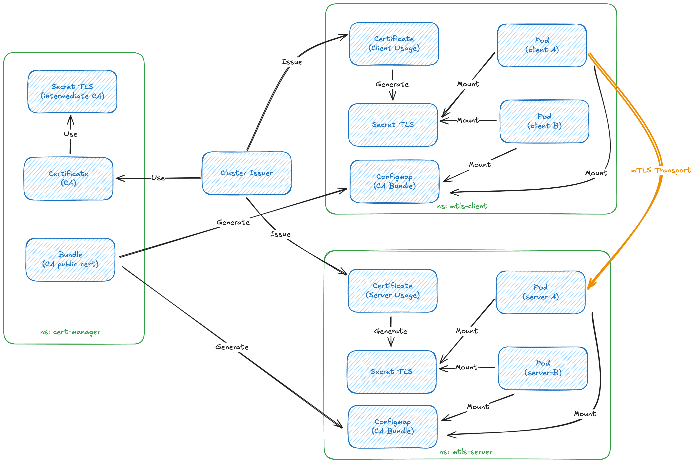

# Kubernetes Deployment Guide

This guide covers deploying the mTLS demo application on Kubernetes with cert-manager for automated certificate management.

## Quick Start

1. **[Setup](./setup.md)** - Install cert-manager and dependencies
2. **[Deploy](./deploy.md)** - Deploy the mTLS demo application  
3. **[Rotate CA](./rotate-ca.md)** - Zero-downtime CA certificate rotation

## Overview

The Kubernetes deployment uses:
- **cert-manager** for automated certificate lifecycle management
- **trust-manager** for CA bundle distribution across namespaces
- **approver-policy** for certificate request validation
- Self-signed root CA with automated certificate provisioning
